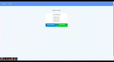

# NoSQL: Gainz Tracker


For this assignment, you'll create a workout tracker. You have already been provided with the front end code in the `Develop` folder. This assignment will require you to create Mongo database with a Mongoose schema and handle routes with Express.

[Live URL](https://nf-gainz-tracker.herokuapp.com/)



## User Story

- As a user, I want to be able to view create and track daily workouts. I want to be able to log multiple exercises in a workout on a given day. I should also be able to track the name, type, weight, sets, reps, and duration of exercise. If the exercise is a cardio exercise, I should be able to track my distance traveled.

## Business Context

A consumer will reach their fitness goals more quickly when they track their workout progress.

## Table of Contents

- [Installation](#installation)
- [Usage](#usage)
- [License](#license)
- [Questions](#questions)
- [Contributing](#contributing)
- [Tests](#tests)

## Installation
  1. In your terminal for the application, run ```npm i``` to install necessary packages.
  2. Run ```npm run seed``` if you would like to be provided seed data.
  3. Run ```npm start``` to start server.

## Usage

This is a simple web application that allows a user to log and track fitness data for the past 7 days. The user can add what workout they have done (cardio or weight training) and view the workout they completed. 

## License

MIT License

      Copyright (c) 2021, Nathan Flessner

      Permission is hereby granted, free of charge, to any person obtaining a copy
      of this software and associated documentation files (the "Software"), to deal
      in the Software without restriction, including without limitation the rights
      to use, copy, modify, merge, publish, distribute, sublicense, and/or sell
      copies of the Software, and to permit persons to whom the Software is
      furnished to do so, subject to the following conditions:

      The above copyright notice and this permission notice shall be included in all
      copies or substantial portions of the Software.

      THE SOFTWARE IS PROVIDED "AS IS", WITHOUT WARRANTY OF ANY KIND, EXPRESS OR
      IMPLIED, INCLUDING BUT NOT LIMITED TO THE WARRANTIES OF MERCHANTABILITY,
      FITNESS FOR A PARTICULAR PURPOSE AND NONINFRINGEMENT. IN NO EVENT SHALL THE
      AUTHORS OR COPYRIGHT HOLDERS BE LIABLE FOR ANY CLAIM, DAMAGES OR OTHER
      LIABILITY, WHETHER IN AN ACTION OF CONTRACT, TORT OR OTHERWISE, ARISING FROM,
      OUT OF OR IN CONNECTION WITH THE SOFTWARE OR THE USE OR OTHER DEALINGS IN THE
      SOFTWARE.

---

## Questions

If you have any questions or concerns you can reach me at [Github](https://github.com/SirNathanJF) or through email at <nathanflessner1@gmail.com>

## Contributing

No contributions needed at this time.

## Tests

Currently there is no testing being performed.